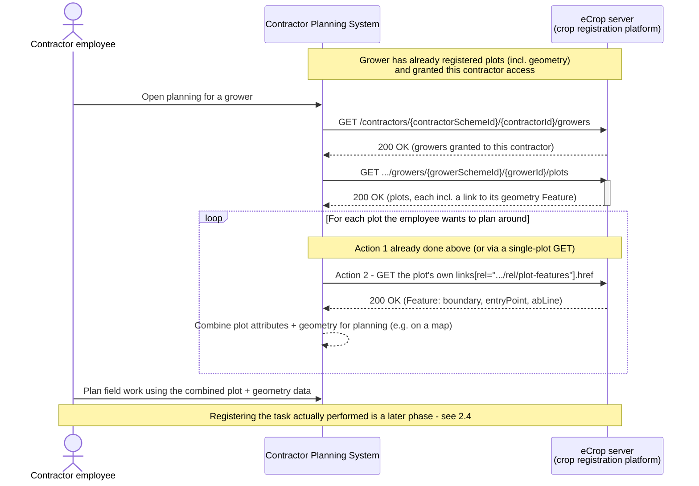

# Contractor planning: retrieving a grower's plots and their geometry

*eCrop API v1.1.0 — a contractor's planning system retrieves a grower's plots and plot geometry to
plan field work. This is phase 1 of a broader business case; phase 2 (§2.4) will add the
contractor registering the tasks it actually performed.*

## 1. Use case and starting points

| Actor / system | Role |
| --- | --- |
| Contractor employee | Plans field work for a grower on behalf of a contractor, using the contractor's own planning software |
| Contractor Planning System (CPS) | The contractor's own system; acts as the eCrop API client, retrieving a grower's plots and their geometry to support planning |
| eCrop server (crop registration platform) | Provides read access to a grower's plots and plot geometry to contractors the grower has granted access to |
| Grower | Has already registered their plots (including geometry) on the platform, and granted this contractor access — no active role in this flow, it's a precondition |

**A contractor employee uses their Contractor Planning System (CPS) to retrieve the plots — and,
for each plot, its geometry — of a grower who has already registered their plots (including
geometry) on the platform and granted this contractor access, so the employee can plan field work
using both a plot's business attributes and its shape/location.**

## 2. Operations used

### 2.1 Core operations for this use case

| Operation | Purpose | Why needed |
| --- | --- | --- |
| `GET /contractors/{contractorSchemeId}/{contractorId}/growers` | Discover which growers have granted this contractor access | Discovery start point — the CPS doesn't need to know a grower's id in advance |
| `GET /contractors/{...}/{..}/growers/{growerSchemeId}/{growerId}/plots` | List a grower's plots (business attributes) — each item already includes a `links` entry pointing at its geometry Feature | **Action 1.** The response carries everything needed for Action 2, so no separate geo-discovery step is needed per plot (see the design note below) |
| `GET /contractors/{...}/{..}/growers/{...}/{..}/plots/{plotSchemeId}/{plotId}` | Retrieve one specific plot, e.g. once the CPS already knows its id from an earlier sync | Same shape (and `links`) as a list item, just scoped to one plot |
| `GET {the plot's `links[rel=".../rel/plot-features"]`.href}` — i.e. `GET /collections/plots/items/{featureId}` on the plot-features server | Retrieve that plot's geometry (boundary, entryPoint, abLine) as a Feature | **Action 2.** The CPS follows the link it was just given — it never computes or guesses a `featureId` itself |

**Design note on "2 actions":** as of this spec version, `plot_200`/`plots_200` responses embed a
`links` array with a custom `rel="https://ecrop.agroconnect.nl/rel/plot-features"` entry pointing
straight at that plot's Feature — and the Feature links back the same way
(`rel="https://ecrop.agroconnect.nl/rel/plot"`), plus carries the originating `plotId` in
`properties`. That's what makes this a clean 2-call flow per plot: get the plot, follow its link.
See §2.2 for why the fuller OGC API Features discovery chain isn't part of this core flow.

### 2.2 Recommended (not required)

- `GET /health` — for the CPS's own monitoring.
- `GET /contractors/{...}/{..}/growers/{growerSchemeId}/{growerId}` — the grower's own details
  (e.g. display name), useful for the CPS's UI.
- `GET /`, `GET /conformance`, `GET /collections`, `GET /collections/plots` — the formal OGC API
  Features discovery chain (landing page → conformance → collections → collection metadata).
  Because the plot's own `links` array already hands the CPS a direct, followable URL to each
  plot's Feature, this case's core flow doesn't need this chain. A fully OGC-API-Features-
  conformant client would still do this once, at integration setup, to confirm which
  profiles/CRSs the server supports.

### 2.3 Explicitly out of scope for this phase

| Domain | Operations | Why out of scope |
| --- | --- | --- |
| Registering plots or crops | `POST`/`PUT`/`DELETE .../plots`, `.../crops` | The grower has already registered these; a contractor never registers a grower's own master data |
| Inbound deliveries | All `.../inbound-deliveries` operations | Different process domain |
| Direct (non-contractor) plot access | `GET /growers/{...}/{..}/plots(/{id})` | That's the grower's own access route (e.g. via their own FMS) — this case is specifically the contractor-scoped route |
| Supplier-scoped access | `/suppliers/*` | No supplier role in this case |

### 2.4 Deferred to a follow-up phase of this business case

Registering the task(s) the contractor actually performs —
`POST`/`PUT`/`DELETE /growers/{growerSchemeId}/{growerId}/plots/{plotSchemeId}/{plotId}/tasks(/{taskSchemeId}/{taskId})`
— is the natural next phase of this business case, once planning is complete and work is executed
in the field. This is *not* out of scope forever, unlike §2.3 — this document will be extended to
cover it.

## 3. Example flow



### 3.1 Discover authorized growers

```http
GET /contractors/com.my-mps.codelist.guid/5d4e3f2a-1b0c-9d8e-7f6a-5b4c3d2e1f0a/growers
Major-Version: v1
User-Agent: contractor-planning-system/1.0
```

```json
[
  {
    "id": {
      "content": "e3c8a1b2-4f6e-4a2d-8e3b-9c1d2e3f4a5b",
      "schemeId": "com.my-mps.codelist.guid"
    },
    "thirdPartyIds": [
      { "content": "09123559", "schemeId": "nl.kvk.codelist.kvknummer" }
    ],
    "name": "Kwekerij De Lier"
  }
]
```

### 3.2 Action 1 — retrieve a plot

```http
GET /contractors/com.my-mps.codelist.guid/5d4e3f2a-1b0c-9d8e-7f6a-5b4c3d2e1f0a/growers/com.my-mps.codelist.guid/e3c8a1b2-4f6e-4a2d-8e3b-9c1d2e3f4a5b/plots/com.my-mps.codelist.guid/e7f8a9b0-1c2d-3e4f-5a6b-7c8d9e0f1a2b
```

```json
{
  "id": {
    "content": "e7f8a9b0-1c2d-3e4f-5a6b-7c8d9e0f1a2b",
    "schemeId": "com.my-mps.codelist.guid"
  },
  "thirdPartyIds": [
    { "content": "A342_1_6", "schemeId": "com.my-mps.codelist.kasnummer" }
  ],
  "name": "Tuin1, perceel6",
  "startDate": "2024-01-12",
  "endDate": "2024-12-14",
  "type": "CROPFIELD",
  "area": {
    "content": 6000,
    "unitCode": { "content": "MTK", "listId": "nl.agroconnect.codelist.cl020" }
  },
  "regularOrOrganic": { "content": "REGULAR", "listId": "nl.agroconnect.codelist.cl015" },
  "localSoilType": { "content": "CLAY", "listId": "nl.agroconnect.codelist.cl405" },
  "regulatorySoilType": { "content": "CLAY", "listId": "nl.agroconnect.codelist.cl405" },
  "links": [
    {
      "rel": "https://ecrop.agroconnect.nl/rel/plot-features",
      "href": "https://standard-api.agroconnect.nl/plot-features/v1/collections/plots/items/384912567",
      "type": "application/geo+json",
      "title": "Geo-information (boundary, entryPoint, abLine) as OGC feature"
    }
  ]
}
```

### 3.3 Action 2 — follow the link to the plot's geometry

Note this is on the separate plot-geometry server (`.../plot-features/v1`, not `.../ecrop/v1`) —
the `href` above already points there, so the CPS just follows it as given:

```http
GET https://standard-api.agroconnect.nl/plot-features/v1/collections/plots/items/384912567
```

```json
{
  "type": "Feature",
  "id": 384912567,
  "geometry": {
    "type": "Polygon",
    "coordinates": [
      [
        [5.7519, 51.9485],
        [5.7811, 51.9485],
        [5.7811, 51.9665],
        [5.7519, 51.9665],
        [5.7519, 51.9485]
      ]
    ]
  },
  "properties": {
    "plotId": {
      "content": "e7f8a9b0-1c2d-3e4f-5a6b-7c8d9e0f1a2b",
      "schemeId": "com.my-mps.codelist.guid"
    },
    "name": "Tuin1, perceel6",
    "area": {
      "content": 6000,
      "unitCode": { "content": "MTK", "listId": "nl.agroconnect.codelist.cl020" }
    },
    "entryPoint": { "type": "Point", "coordinates": [5.7527, 51.9487] },
    "abLine": {
      "type": "LineString",
      "coordinates": [
        [5.7548, 51.9494],
        [5.7782, 51.9655]
      ]
    }
  },
  "links": [
    {
      "rel": "self",
      "href": "https://standard-api.agroconnect.nl/plot-features/v1/collections/plots/items/384912567",
      "type": "application/geo+json"
    },
    {
      "rel": "https://ecrop.agroconnect.nl/rel/plot",
      "href": "https://standard-api.agroconnect.nl/ecrop/v1/growers/com.my-mps.codelist.guid/e3c8a1b2-4f6e-4a2d-8e3b-9c1d2e3f4a5b/plots/com.my-mps.codelist.guid/e7f8a9b0-1c2d-3e4f-5a6b-7c8d9e0f1a2b",
      "type": "application/json"
    }
  ]
}
```

The CPS now has both the plot's attributes (from §3.2) and its shape/location (from this
response) to plan the field work.

## 4. Still to be arranged

### 4.1 Security

The spec defines no `securitySchemes` yet. Specific to this case: `GET /contractors/{...}/{..}/growers`
already reflects *which* growers have granted a contractor access, but not how that grant is
established, authenticated, or revoked — that mandate-management process still needs to be
designed, along with whether a CPS authenticates as the contractor organisation as a whole, or as
the individual employee using it.

### 4.2 CRS choice for the planning UI

`GET .../collections/plots/items/{featureId}` defaults to `profile=rfc7946` (plain GeoJSON,
always WGS84), as used in §3.3. Since this CPS is meant to show a field on a map for planning,
it's worth deciding whether `profile=jsonfg` with `crs=EPSG:28992` (RD New) is a better default —
agricultural GPS/steering systems in the Netherlands typically work in RD New rather than WGS84.

### 4.3 No change notifications — polling only

If the grower adds/removes a plot, edits its geometry, or revokes the contractor's access after
the CPS has already cached plot data, there is no push/webhook mechanism in the spec to notify the
CPS. The CPS must re-poll `GET .../growers` and `GET .../growers/{...}/{..}/plots` periodically to
stay current, and needs its own policy for how long cached (possibly now-stale, or no-longer-
authorized) plot/geometry data may be used for planning before the next poll.

### 4.4 Identifier schemes and code lists

The example payloads above reuse the spec's own placeholder `schemeId`/`listId` values (e.g.
`com.my-mps.codelist.guid`, `com.my-mps.codelist.kasnummer`, `nl.agroconnect.codelist.cl020` for
units, `nl.agroconnect.codelist.cl015`/`cl405` for the organic/soil-type code lists). These need
to be confirmed as definitive, published schemes/code lists before production use.
