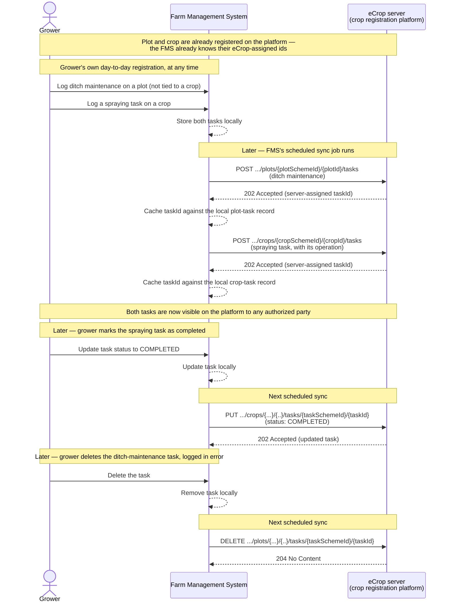

# Farm Management System sync of executed field operations

*eCrop API v1.1.0 — a grower's own Farm Management System automatically syncs executed field
operations, at both plot level and crop level, to the crop registration platform.*

## 1. Use case and starting points

| Actor / system | Role |
| --- | --- |
| Grower | Performs field/crop activities and registers them in their own Farm Management System (FMS) — never uses the eCrop platform's UI directly for this |
| Farm Management System (FMS) | The grower's own system of record for executed operations; acts as the eCrop API client, automatically syncing tasks/operations for existing plots and crops to the platform |
| eCrop server (crop registration platform) | Central platform that stores the synced registrations, making them available to other authorized parties (advisers, buyers, certifiers) without the grower re-keying data anywhere else |

**A grower's own Farm Management System (FMS) automatically and periodically syncs executed field
operations — grouped as tasks with one or more operations — to the eCrop platform, both at plot
level (e.g. general field work not tied to one crop, such as ditch maintenance) and at crop level
(e.g. spraying, fertilizing, harvesting), for plots and crops that are already registered on the
platform.**

Registering the plots and crops themselves is out of scope for this case (see §2.3) — this case
assumes that has already happened, by whatever process registered them, and that the FMS already
knows the resulting `plotId`/`cropId` values to register tasks against (see §4.1 for how that's
expected to work).

## 2. Operations used

### 2.1 Core operations for this use case

| Operation | Purpose | Why needed |
| --- | --- | --- |
| `POST /growers/{growerSchemeId}/{growerId}/plots/{plotSchemeId}/{plotId}/tasks` | Register a newly executed non-crop-specific task (with its operations) on an existing plot | Core of the use case: general field work not tied to one crop |
| `PUT /growers/{...}/{..}/plots/{...}/{..}/tasks/{taskSchemeId}/{taskId}` | Update a previously synced plot-level task, e.g. a status change or corrected details | Preferred over re-`POST`ing once the id is known, per the spec's own recommendation |
| `DELETE /growers/{...}/{..}/plots/{...}/{..}/tasks/{taskSchemeId}/{taskId}` | Remove a plot-level task registered in error, or deleted in the FMS | Keeps the platform consistent with the FMS as the source of truth |
| `POST /growers/{...}/{..}/crops/{cropSchemeId}/{cropId}/tasks` | Register a newly executed task (with its operations) on an existing crop | Core of the use case: crop-specific field activities |
| `PUT /growers/{...}/{..}/crops/{...}/{..}/tasks/{taskSchemeId}/{taskId}` | Update a previously synced crop-level task | Preferred over re-`POST`ing once the id is known |
| `DELETE /growers/{...}/{..}/crops/{...}/{..}/tasks/{taskSchemeId}/{taskId}` | Remove a crop-level task registered in error, or deleted in the FMS | Keeps the platform consistent with the FMS |

### 2.2 Recommended (not required)

- `GET /health` — for the FMS's own scheduled-sync job, to skip/retry a run rather than fail
  loudly if the eCrop server is temporarily unreachable.
- `GET /growers/{...}/{..}/plots` and `GET .../plots/{plotSchemeId}/{plotId}` — useful to look up
  or confirm a plot's eCrop id before registering a task against it. There is no equivalent `GET`
  for crops at all — see §4.1.

### 2.3 Explicitly out of scope for this phase

| Domain | Operations | Why out of scope |
| --- | --- | --- |
| Registering plots themselves | `POST`/`PUT`/`DELETE /growers/{...}/{..}/plots` | Assumed already registered on the platform by another process; this case only registers operations *against* them |
| Registering crops themselves | `POST`/`PUT`/`DELETE /growers/{...}/{..}/crops` | Same — assumed already registered |
| Farm-level (production-location) task registration | `.../production-locations/{...}/{..}/tasks` | Out of scope for this case; not tied to a plot or crop |
| Inbound deliveries | All `.../inbound-deliveries` operations | Different process domain — see the [supplier inbound delivery registration case](../supplier-inbound-delivery-registration/README.md) |
| Parties lookup | `GET /growers`, `/suppliers`, `/contractors`, etc. | The FMS already knows its own grower's identity via its integration configuration |
| Contractor/supplier-scoped access | `/contractors/*`, `/suppliers/*/growers/*` | No contractor or supplier role in this case — the FMS acts directly as the grower's own client |
| Plot-geometry (OGC) | `/`, `/conformance`, `/collections`, `.../items` | Unrelated to registering executed operations |

## 3. Example flow



### 3.1 Register a plot-level task

A non-crop-specific task, e.g. ditch maintenance on plot `e7f8a9b0-1c2d-3e4f-5a6b-7c8d9e0f1a2b`
("Tuin1, perceel6" — already registered on the platform):

```http
POST /growers/com.my-mps.codelist.guid/e3c8a1b2-4f6e-4a2d-8e3b-9c1d2e3f4a5b/plots/com.my-mps.codelist.guid/e7f8a9b0-1c2d-3e4f-5a6b-7c8d9e0f1a2b/tasks
Major-Version: v1
User-Agent: fms-sync-job/1.0
Content-Type: application/json
```

```json
{
  "thirdPartyIds": [
    { "content": "31820", "schemeId": "com.my-mps.codelist.registratienummer" }
  ],
  "name": "Slootkant maaien",
  "startDateTime": "2025-04-02T08:00:00+02:00",
  "endDateTime": "2025-04-02T09:30:00+02:00",
  "status": "COMPLETED",
  "operations": [
    {
      "thirdPartyIds": [
        { "content": "31820-1", "schemeId": "MPS" }
      ],
      "name": "Maaien slootkant",
      "startDateTime": "2025-04-02T08:00:00+02:00",
      "endDateTime": "2025-04-02T09:30:00+02:00",
      "type": { "content": "MOWING", "listId": "nl.agroconnect.codelist.cl127" },
      "technique": { "content": "MOWING", "listId": "nl.agroconnect.codelist.cl302" },
      "status": "COMPLETED",
      "area": {
        "content": 450,
        "unitCode": { "content": "MTK", "listId": "nl.agroconnect.codelist.cl020" }
      }
    }
  ]
}
```

Response — `202 Accepted`, with the server-assigned `id` the FMS caches locally:

```json
{
  "id": {
    "content": "6d7e8f9a-0b1c-2d3e-4f5a-6b7c8d9e0f1a",
    "schemeId": "com.my-mps.codelist.guid"
  },
  "thirdPartyIds": [
    { "content": "31820", "schemeId": "com.my-mps.codelist.registratienummer" }
  ],
  "name": "Slootkant maaien",
  "startDateTime": "2025-04-02T08:00:00+02:00",
  "endDateTime": "2025-04-02T09:30:00+02:00",
  "status": "COMPLETED",
  "operations": [
    {
      "thirdPartyIds": [
        { "content": "31820-1", "schemeId": "MPS" }
      ],
      "name": "Maaien slootkant",
      "startDateTime": "2025-04-02T08:00:00+02:00",
      "endDateTime": "2025-04-02T09:30:00+02:00",
      "type": { "content": "MOWING", "listId": "nl.agroconnect.codelist.cl127" },
      "technique": { "content": "MOWING", "listId": "nl.agroconnect.codelist.cl302" },
      "status": "COMPLETED",
      "area": {
        "content": 450,
        "unitCode": { "content": "MTK", "listId": "nl.agroconnect.codelist.cl020" }
      }
    }
  ]
}
```

### 3.2 Register a crop-level task with its operation

A crop-specific task, e.g. spraying on crop `c9a7b8e2-3d4f-5e6a-7b8c-9d0e1f2a3b4c`
("Tomaat 2025" — already registered on the platform):

```http
POST /growers/com.my-mps.codelist.guid/e3c8a1b2-4f6e-4a2d-8e3b-9c1d2e3f4a5b/crops/com.my-mps.codelist.guid/c9a7b8e2-3d4f-5e6a-7b8c-9d0e1f2a3b4c/tasks
```

```json
{
  "thirdPartyIds": [
    { "content": "27575", "schemeId": "com.my-mps.codelist.registratienummer" }
  ],
  "name": "Spraying task",
  "startDateTime": "2025-03-12T15:51:00+01:00",
  "endDateTime": "2025-03-12T16:45:00+01:00",
  "status": "PROPOSED",
  "operations": [
    {
      "thirdPartyIds": [
        { "content": "27575-1", "schemeId": "MPS" }
      ],
      "name": "Spraying operation",
      "startDateTime": "2025-03-12T15:51:00+01:00",
      "endDateTime": "2025-03-12T16:45:00+01:00",
      "type": { "content": "SPRAYING", "listId": "nl.agroconnect.codelist.cl127" },
      "technique": { "content": "SPRAYING", "listId": "nl.agroconnect.codelist.cl302" },
      "status": "PROPOSED",
      "inputAllocations": [
        {
          "thirdPartyIds": [
            { "content": "52521785", "schemeId": "com.my-mps.codelist.registratienummer" }
          ],
          "name": "Movento",
          "type": { "content": "PROTEC", "listId": "nl.agroconnect.codelist.cl127" },
          "quantity": {
            "content": 1200,
            "unitCode": { "content": "KGM", "listId": "nl.agroconnect.codelist.cl020" }
          },
          "reason": "Bladluis",
          "product": {
            "thirdPartyIds": [
              { "content": "838439 N", "schemeId": "nl.ctgb.codelist.toelatingsnummer" }
            ],
            "name": "Movento 100 SC - 1L - spirotetramat"
          },
          "treatmentzone": {
            "thirdPartyIds": [
              { "content": "PAD-1-99", "schemeId": "com.my-mps.codelist.padnummers" }
            ],
            "area": {
              "content": 23500,
              "unitCode": { "content": "MTK", "listId": "nl.agroconnect.codelist.cl020" }
            }
          }
        }
      ]
    }
  ]
}
```

→ `202 Accepted`, with server-assigned `id` `2b3c4d5e-6f7a-8b9c-0d1e-2f3a4b5c6d7e`.

### 3.3 Sync a status update (crop-level task)

Same body as §3.2, `status` changed from `"PROPOSED"` to `"COMPLETED"`:

```http
PUT /growers/com.my-mps.codelist.guid/e3c8a1b2-4f6e-4a2d-8e3b-9c1d2e3f4a5b/crops/com.my-mps.codelist.guid/c9a7b8e2-3d4f-5e6a-7b8c-9d0e1f2a3b4c/tasks/com.my-mps.codelist.guid/2b3c4d5e-6f7a-8b9c-0d1e-2f3a4b5c6d7e
```

→ `202 Accepted` with the updated task. Plot-level tasks are updated the same way, at
`.../plots/{plotSchemeId}/{plotId}/tasks/{taskSchemeId}/{taskId}`.

### 3.4 Sync a deletion (plot-level task)

```http
DELETE /growers/com.my-mps.codelist.guid/e3c8a1b2-4f6e-4a2d-8e3b-9c1d2e3f4a5b/plots/com.my-mps.codelist.guid/e7f8a9b0-1c2d-3e4f-5a6b-7c8d9e0f1a2b/tasks/com.my-mps.codelist.guid/6d7e8f9a-0b1c-2d3e-4f5a-6b7c8d9e0f1a
```

→ `204 No Content`. Crop-level tasks are removed the same way, at
`.../crops/{cropSchemeId}/{cropId}/tasks/{taskSchemeId}/{taskId}`.

## 4. Still to be arranged

### 4.1 How the FMS learns plot and crop ids

This case assumes the FMS already knows the eCrop-assigned `plotId`/`cropId` to register a task
against. For plots that's workable — `GET /growers/{...}/{..}/plots` and `GET .../plots/{plotSchemeId}/{plotId}`
exist, so the FMS can look them up (e.g. matched against its own plot records via `thirdPartyIds`).
For crops there is no `GET` at all (see §4.2), so this case still needs an answer for how the FMS
obtains a `cropId` in the first place — e.g. whatever process registers the crop must hand that id
back to the FMS out-of-band, or the crop-registration case and this one need to be integrated.

### 4.2 No `GET` for crops or tasks

There is no `GET` operation for a single crop, or for a task at all — the spec only exposes
`POST`/`PUT`/`DELETE` for both. This means the FMS cannot reconcile its local sync-state against
eCrop by querying it back; the FMS's own database is the only place that can answer "did this
sync, and under which eCrop id?". If that local state is lost (e.g. a database restore to an older
backup), there is currently no way to recover the mapping other than re-`POST`ing everything and
relying on the `thirdPartyIds` dedupe behaviour.

### 4.3 Sync failure handling

The spec doesn't define any batch or transactional semantics — each `POST`/`PUT`/`DELETE` is
atomic on its own. If a sync run registers several tasks and one call fails partway through
(network error, `5xx`, validation error), the FMS needs its own retry/resume logic to avoid
re-sending calls that already succeeded, or missing ones that didn't.

### 4.4 Security

The spec defines no `securitySchemes` yet. Specific to this case: since the FMS acts as a
long-running, unattended background client (not a human clicking through an OAuth consent
screen), a client-credentials-style flow is the natural fit — but this, along with how an FMS
instance is provisioned for a specific `growerId`, still needs to be designed.

### 4.5 Identifier schemes and code lists

The example payloads above reuse the spec's own placeholder `schemeId`/`listId` values (e.g.
`nl.agroconnect.codelist.cl127` for operation types, `nl.agroconnect.codelist.cl302` for
techniques), plus an invented `MOWING` code for the ditch-maintenance example. These need to be
confirmed as definitive, published schemes/code lists before production use — and, specific to
this case, FMS vendors need a way to map their own internal codes (operation types, techniques,
product codes) onto whichever codelists are ultimately designated as canonical.
