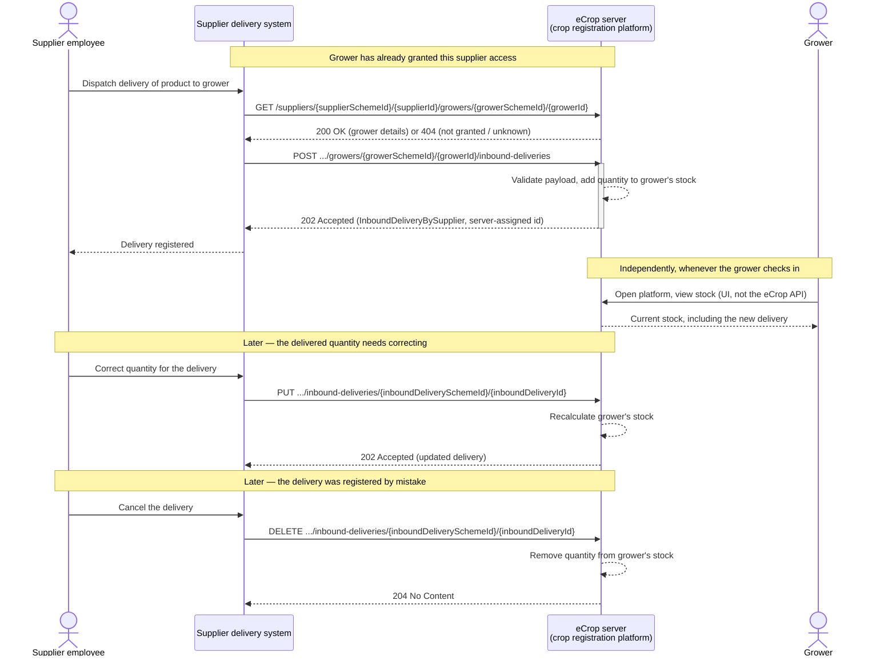

# Supplier inbound delivery registration

*eCrop API v1.1.0 — a supplier's delivery system registers inbound deliveries for a grower, so
the grower's product stock on the crop registration platform stays up to date automatically.*

## 1. Use case and starting points

| Actor / system | Role |
| --- | --- |
| Supplier employee | Person at the supplier (e.g. warehouse/logistics staff) who dispatches a delivery to a grower |
| Supplier delivery system | The supplier's own order/logistics system; acts as the eCrop API client |
| eCrop server (crop registration platform) | Processes inbound-delivery registrations and maintains the grower's product stock |
| Grower | Uses the crop registration platform's own UI to see their current stock — does **not** call the eCrop API in this use case |

**A supplier's delivery system registers, corrects, and cancels inbound deliveries of products to
a specific grower's production location via the eCrop API, for growers that have granted this
supplier access. The crop registration platform derives the grower's product stock from these
registrations, so the grower always sees an up-to-date stock position without any manual data
entry.**

Because the grower only consumes the resulting stock view inside the platform's own UI — not via
the eCrop API — the grower doesn't appear in the operations table below, but does appear as an
actor in the flow diagram in §3, to make clear where the data ends up.

## 2. Operations used

### 2.1 Core operations for this use case

| Operation | Purpose | Why needed |
| --- | --- | --- |
| `GET /suppliers/{supplierSchemeId}/{supplierId}/growers/{growerSchemeId}/{growerId}` | Confirm the supplier is currently granted access to this grower before registering a delivery for them | A `404` here means "not granted, or grower doesn't exist" — avoids blindly `POST`ing to a grower the supplier has no (or no longer has) access to |
| `POST /suppliers/{supplierSchemeId}/{supplierId}/growers/{growerSchemeId}/{growerId}/inbound-deliveries` | Register a newly dispatched delivery | Core of the use case: this is what feeds the grower's stock |
| `PUT /suppliers/{supplierSchemeId}/{supplierId}/growers/{growerSchemeId}/{growerId}/inbound-deliveries/{inboundDeliverySchemeId}/{inboundDeliveryId}` | Correct a previously registered delivery (e.g. a quantity adjusted after a partial delivery, or a data-entry error) | Keeps the grower's stock accurate without deleting and recreating history |
| `DELETE /suppliers/{supplierSchemeId}/{supplierId}/growers/{growerSchemeId}/{growerId}/inbound-deliveries/{inboundDeliverySchemeId}/{inboundDeliveryId}` | Retract a delivery that was registered in error (e.g. duplicate, cancelled order) | Removes it from the grower's stock calculation |

### 2.2 Recommended (not required)

- `GET /health` — for the supplier delivery system's own monitoring, to confirm the eCrop server
  is reachable before attempting to register a batch of deliveries.
- `GET /suppliers/{supplierSchemeId}/{supplierId}/growers` — useful once, during onboarding, to
  let a supplier employee pick which of their authorized growers to enable automatic delivery
  registration for. Not needed on every delivery.

### 2.3 Explicitly out of scope for this phase

| Domain | Operations | Why out of scope |
| --- | --- | --- |
| Grower-initiated deliveries | `POST`/`PUT`/`DELETE /growers/{...}/{..}/inbound-deliveries` | This case is exclusively supplier-initiated; a grower registering their own deliveries is a separate use case |
| Plots & crops | `GET`/`POST`/`PUT`/`DELETE .../plots`, `.../crops` | Not relevant to registering a delivery; stock is tracked per grower/product, not per plot or crop |
| Tasks & operations | All `.../tasks` operations | Different process domain (field/crop activities, not deliveries) |
| Contractors | `/contractors/*` | No contractor role in this case |
| Plot-geometry (OGC) | `/`, `/conformance`, `/collections`, `.../items` | Unrelated to deliveries |
| Grower-scoped production locations | `GET /growers/{...}/{..}/production-locations` | Only the grower's own bms can call this; there is no equivalent supplier-scoped endpoint (see §4.3) |

## 3. Example flow



### 3.1 Register a delivery

Request (identifiers reused from the spec's own `Supplier`/`Grower` examples — Van Iperen
delivering to Kwekerij De Lier):

```http
POST /suppliers/com.my-mps.codelist.guid/7a2e4c3d-9b8f-1a2c-3e4d-5f6a7b8c9d0e/growers/com.my-mps.codelist.guid/e3c8a1b2-4f6e-4a2d-8e3b-9c1d2e3f4a5b/inbound-deliveries
Major-Version: v1
User-Agent: supplier-delivery-system/1.0
Content-Type: application/json
```

```json
{
  "thirdPartyIds": [
    { "content": "84037601", "schemeId": "com.iperen.codelist.orderregelnummer" }
  ],
  "dateOfDelivery": "2025-01-23",
  "quantity": {
    "content": 1200,
    "unitCode": { "content": "KGM", "listId": "nl.agroconnect.codelist.cl020" }
  },
  "product": {
    "thirdPartyIds": [
      { "content": "1928", "schemeId": "com.iperen.codelist.artikelnummer" },
      { "content": "8700127724892", "schemeId": "nl.gs1.gtin" }
    ],
    "name": "Peters professional 10-12-18, Blossom Booster"
  },
  "location": {
    "thirdPartyIds": [
      { "content": "1", "schemeId": "com.iperen.codelist.cl030" }
    ],
    "name": "De Tuinderij Honselersdijk"
  }
}
```

Response — `202 Accepted`, with the server-assigned `id` the supplier system must keep for any
later `PUT`/`DELETE`:

```json
{
  "id": {
    "content": "6f6d3b8c-2e7a-4a1d-9b2c-0e1f2a3b4c5d",
    "schemeId": "com.my-mps.codelist.guid"
  },
  "thirdPartyIds": [
    { "content": "84037601", "schemeId": "com.iperen.codelist.orderregelnummer" }
  ],
  "dateOfDelivery": "2025-01-23",
  "quantity": {
    "content": 1200,
    "unitCode": { "content": "KGM", "listId": "nl.agroconnect.codelist.cl020" }
  },
  "product": {
    "thirdPartyIds": [
      { "content": "1928", "schemeId": "com.iperen.codelist.artikelnummer" },
      { "content": "8700127724892", "schemeId": "nl.gs1.gtin" }
    ],
    "name": "Peters professional 10-12-18, Blossom Booster"
  },
  "location": {
    "thirdPartyIds": [
      { "content": "1", "schemeId": "com.iperen.codelist.cl030" }
    ],
    "name": "De Tuinderij Honselersdijk"
  }
}
```

### 3.2 Correct the delivered quantity

Same body as §3.1, `quantity.content` changed from `1200` to `1150`, sent as:

```http
PUT /suppliers/com.my-mps.codelist.guid/7a2e4c3d-9b8f-1a2c-3e4d-5f6a7b8c9d0e/growers/com.my-mps.codelist.guid/e3c8a1b2-4f6e-4a2d-8e3b-9c1d2e3f4a5b/inbound-deliveries/com.my-mps.codelist.guid/6f6d3b8c-2e7a-4a1d-9b2c-0e1f2a3b4c5d
```

→ `202 Accepted` with the updated delivery. The platform recalculates the grower's stock from
the new quantity rather than adding a second delivery.

### 3.3 Cancel a delivery

```http
DELETE /suppliers/com.my-mps.codelist.guid/7a2e4c3d-9b8f-1a2c-3e4d-5f6a7b8c9d0e/growers/com.my-mps.codelist.guid/e3c8a1b2-4f6e-4a2d-8e3b-9c1d2e3f4a5b/inbound-deliveries/com.my-mps.codelist.guid/6f6d3b8c-2e7a-4a1d-9b2c-0e1f2a3b4c5d
```

→ `204 No Content`. The quantity is removed from the grower's stock.

### 3.4 Error case: supplier not (or no longer) granted access

If the grower has not granted this supplier access (or has revoked it), both the discovery `GET`
in §2.1 and the `POST`/`PUT`/`DELETE` calls return:

```json
{
  "status": 403,
  "title": "Forbidden",
  "detail": "You are not allowed to perform this request because you do not have the required permissions"
}
```

## 4. Still to be arranged

### 4.1 Duplicate-delivery risk on retry

Unlike `plots`, `crops` and `tasks`, the spec does not document a "repeated `POST` with the same
`thirdPartyIds` updates the existing delivery" behaviour for `inbound-deliveries`. If the supplier
delivery system retries a `POST` after a timeout — without knowing whether the first attempt
actually succeeded — it risks registering the same delivery twice and inflating the grower's
stock. Until this is clarified or fixed in the spec, the supplier system must reliably persist the
returned `id` on success and treat retries with care (e.g. check via the response of a prior
attempt before re-sending).

### 4.2 Discovering a grower's production location

`location` (a `ProductionLocationDetails`) is required on every delivery, but there is no
supplier-scoped endpoint to look up a grower's production locations —
`GET /growers/{...}/{..}/production-locations` can only be called by the grower's own bms. The
supplier needs another, currently out-of-standard way to learn a grower's location
id/`thirdPartyIds` (e.g. as part of onboarding/master-data exchange when the access grant is
set up).

### 4.3 Stock is not itself part of the standard

eCrop has no `GET .../stock` operation. "Stock" is an aggregate the platform is expected to
compute internally from the cumulative history of `inbound-deliveries` for a grower/product. How
(or whether) stock *consumption* — e.g. via crop protection products used in a `task`'s
`inputAllocations` — should reduce this same stock is undecided and out of scope for this case.

### 4.4 Security

The spec defines no `securitySchemes` yet. Specific to this case: the `/suppliers/{...}/{..}/growers`
operations already reflect *which* growers have granted a supplier access, but not how that grant
is established, authenticated, or revoked — that mandate-management process still needs to be
designed.

### 4.5 Identifier schemes and code lists

The example payloads above reuse the spec's own placeholder `schemeId`/`listId` values (e.g.
`com.iperen.codelist.orderregelnummer`, `nl.gs1.gtin`, `nl.agroconnect.codelist.cl020` for units).
These need to be confirmed as definitive, published schemes/code lists before production use.
